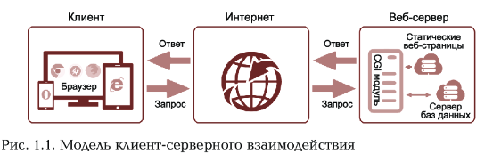

# 1 ГЛАВА

## ОСНОВЫ ВЕБ-ТЕХНОЛОГИЙ

### 1.1 <u> ВВЕДЕНИЕ В ОСНОВЫ ВЕБ-ТЕХНОЛОГИЙ </u>

### 1.1.1. Термины и определения, используемые веб-технологиях

&nbsp; &nbsp; Методы и средства информационных веб-технологии применяются повсеместно в жизнедеятельности каждого человека. Среда Интернета предоставляет огромные возможности отдельному человеку и обществу, являясь местом организации и ведения бизнеса предоставления рекламы и новостей, средством общения, важным источником разного вида информации и т.д. Интеллектуальный труд максимально ориентирован на использование информационных ресурсов глобальной сети. Это влечет за собой увеличение количества создаваемых веб-сайтов, используемых для разных целей и разными категориями пользователей.  
&nbsp; &nbsp; **Веб-технологии** - программные, аппаратные, вычислительные методы и средства организации взаимодействия между пользователями в глобальной сети.
Организация взаимодействия осуществляется через интерфейсы веб-сайтов посредством разных веб-браузеров. Основная цель применения возможностей веб-технологий при создании веб-сайтов заключается в создании простых, понятных, дешевых, гибких, человеко-ориентированных систем и интерфейсов с использованием классических и современных методов, стандартов, средств эргономики, дизайна и компьютерной графики.  
&nbsp; &nbsp; **Интернет** - компьютерное информационное пространство, глобальная сеть, функционирующая по определенным правилам и стандартам, объединяющая абонентов разных стран и континен: тов, включающая множество точек, узлов, представленных в виде и других устройств, раскиданных по всему миру.
Существуют и другие определения глобальной сети, ориентированные на международные стандарты ИСО/МЭК

- **веб-сервис** (Web service) - ресурс сети, предоставляющий информационное наполнение и (или) функциональные возможно-сти, к которым можно обратиться дистанционно через стандар-тизированные протоколы и программные интерфейсы (п. 3.32):
- **веб-приложение** (Web application, World Wide Web application) -
приложение, предоставляющее функциональные возможности пользователю через браузер или другой тип агента пользователя. использующего веб-форматы и протоколы (п. 3.34):
- **сайт, веб-сайт** (website, site) - последовательный набор взаимосвязанных ресурсов сети (например, веб-страниц или веб-сервисов), который размещен на одном или нескольких ком-пьютерах, подключенных к Интернету, и к нему можно обращаться через совокупность спецификаций того же домена URL (п. 3.33);
- **веб-страница** (Web page) - последовательное представление объекта или набора объектов информационного наполнения и связанных с ними объектов взаимодействия через агента пользователя (п. 3.31).
Далее в тексте будет употребляться термин «веб-документ», который может относиться как к веб-странице, так и к веб-сайту (подразумевается несколько веб-страниц).
### 
 1.1.2 Организация клиент-северного взаимодействия в Интернете 

&nbsp; &nbsp; &nbsp;**Глобальные сети** являются открытыми и ориентированными на обслуживание любых пользователей. Существуют и другие виды сетей, такие как локальная, региональная, корпоративная. Все имеющиеся варианты сетей могут быть присоединены к глобальной сети, если это не противоречит интересам участников взаимодей-ствия, которыми могут быть физические и юридические лица.  
&nbsp; &nbsp; &nbsp;Компьютеры, входящие в состав глобальной сети, можно условно
разделить на два основных класса: клиенты и серверы.  
&nbsp; &nbsp; &nbsp;Концептуальная модель организации в заимодействия в Интер-нете, построение клиентского и серверного программного обеспечения основаны на международных принципах и разработанных стандартах протоколов. 
&nbsp; &nbsp; &nbsp;Так как обмен информацией между клиентом и сервером в средне Интернета осуществляется с использованием кроссплатформенных стандартов протоколов низкого (TCP/IP) и высокого (HTTP) уровней то нет необходимости знания того какой именно клиент пользуется ресурсом. В качестве ресурсов могут использоваться файлы на веб-серверах, серверах локальной вычистлительной сети или на компьютерре пользователя почтовые ящики электронной почты и т.д  
&nbsp; &nbsp; &nbsp;**Программное опеспечение** (**ПО**) клиентов может включать браузер, почтовые приложения, мультимедийные средства, клиентские модули систем групповой работы и т.д  
&nbsp; &nbsp; &nbsp;Взаимодействие в Интернете происходит по определенному алгоритму: клиент запрашивает веб-страницу с определенным адресом, в ответ на запрос клиента формируется веб-страница и отправляется сервером клиенту.  
&nbsp; &nbsp; &nbsp;**Адреса** запрашиваемых документов содержатся в их URL  
&nbsp; &nbsp; &nbsp;Название протолока ставится в начале адреса, например _https://int.ss.mw.com/catalog.html_  
&nbsp; &nbsp; &nbsp;Протокол https предназначен для передачи гипертекста и шифрования данных. Файл _catalog.html_ нахоидтся на сервере int. ss.mw.com. С помощью этих адресов можно легко переходить от одного ресурса к другому.  
&nbsp; &nbsp; &nbsp;В соответствии с пп. 4 п. 2 ст. 1484 Гражданского кодекса Российской Федерации (ГК РФ) **доменное имя** является способом адресации в Интернете. Согласно п. 15 ст. 2 Федерального закона от 27 июля 2006 г. No 149-ФЗ «Об информации, информационных технологиях и о защите информации» доменное имя обозначение символами, предназначенное для адресации сайтов в Интернете в целях обеспечения доступа к информации, размещенной в Интернете.  
&nbsp; &nbsp; &nbsp;Запись в иерархической структуре имен начинается от послед- ней записи к первой через точку, завершается корневым именем, обладает уникальностью названия и автономностью на каждом из уровней. Такой подход позволяет разграничить поддержку и от- ветственность юридических и физических лиц в пределах ограни- ченного уровня иерархии.  
&nbsp; &nbsp; &nbsp;**Домены** классифицируются и различаются по уровням. К доменам первого, верхнего, уровня относятся территориальные и внетерриториальные. Территориальные относятся к какой-то стране и для идентификации используют двухбуквенные аббревиатуры: ru (РФ), us (США), fr (Франция) и т.д: _внетерриториальные_ - к разным организациям.  
&nbsp; &nbsp; &nbsp;В зависимости от специфики предметной области организаций используется _аббревиатура_, состоящая из трех знаков букв латинского алфавита, например:  
- сетевые организации - _net_;
- некоммерческие организации - _org_;
- коммерческие организации - _com_;
- образовательные организации - _edu_;
- домен, открытый для всех - _info_;
- для персональных сайтов - _name_;
- для специалистов определенных професий - _pro_;
- правительственные организации - _gov_.  
&nbsp; &nbsp; &nbsp;*Домены* верхнего уровня должны соответствовать международ- ному стандарту МК (ИСО 3166) 004-97 «Межгосударственный классификатор стран мира (МКСМ)».  
&nbsp; &nbsp; &nbsp;Примеры доменов второго уровня - *people.com* или *mail.ru*, домена третьего уровня - *planet.org.ru*.  
&nbsp; &nbsp; &nbsp;Рассмотрим концептуальную модель **клиент-серверного взаимодействия** в Интернете. На рис. 1.1 показана модель взаимодействия и формирования динамической страницы по запросу пользователя. Базы данных и специальные программы (сценарии, скрипты), на- ходящиеся на веб-сервере, генерируют данные по запросу. Запрос с компьютера пользователя, переданный на сервер, обрабатывается программой, после чего создается веб-страница и передается об- ратно на компьютер пользователя. Все это формируется с помощью СGІ-модуля и по правилам, по которым сервер передает запрос программе.  
&nbsp; &nbsp; &nbsp;Страница, созданная заранее, является статической. Для создания *динамической* страницы модуль может использовать любые данные, доступные ему в настоящий момент времени, например результаты поиска в базе данных. Благодаря этому свойству можно заранее обеспечить гибкие интерактивные возможности веб-сервера.  

Для обеспечения этих свойств применяются этих свойств применяются специальные языки и технологии. Динамические страницы позволяют генерировать информацию по запросу. Такую страницу можно создать, например, программной, называемой CGI-модулем (CGI-скриптом), в соответствии с дополнительными данными, содержавшимися в запросе или присланными клиентом, и на основании правил, заложенных при создании CGI-модуля.  
&nbsp; &nbsp; &nbsp;Процесс сохранения часто запрашиваемых документов на промежуточных серверах или устройстве пользователя с целью предотвращения их повторной загрузки с передающего сервера и уменьшения трафика называется **кешированием веб-страниц.** Управление кешированием осуществляется при помощи http-заголовков. При этом информация располагается ближе к пользователю.